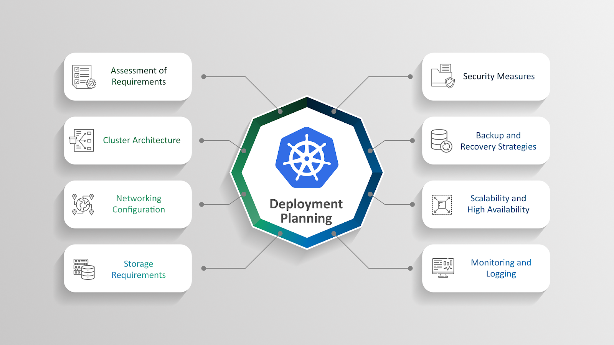

# Kubernetes: Guia essencial para Deployments:rocket:

Este repositório foi criado para ajudar a compreender os conceitos-chave relacionados ao uso de deployments no Kubernetes e como utilizá-lo para orquestrar contêineres de maneira eficiente. 
<hr>

#### :book: O que é Deployment?

Um Deployment no Kubernetes é um recurso que gerencia a implantação e a escalabilidade de Pods (as menores unidades de execução no Kubernetes) de maneira declarativa. Ele é amplamente utilizado para garantir que uma aplicação esteja sempre disponível, saudável e pronta para atender aos usuários, mesmo em cenários de atualização ou falha.

O Deployment oferece uma maneira simples de gerenciar o ciclo de vida de aplicativos, incluindo:

* Criação de réplicas dos pods.
* Atualização da aplicação para novas versões.
* Roolback de versões anteriores em caso de falhas.
* Escalabilidade (manual ou automática).


Quando você cria um Deployment, o Kubernetes cria automaticamente um ReplicaSet associado a ele. Esse ReplicaSet é responsável por garantir que o número desejado de réplicas esteja sempre rodando.

O Kubernetes monitora continuamente o Deployment para garantir que o estado atual do sistema corresponda ao estado desejado especificado no YAML. Se um pod falhar ou for excluído, o ReplicaSet cria novos pods para substituí-los.


COLOCAR EXEMPLOS DE MANIFESTO DEPLOYMENT E EXEMPLOS PRÁTICOS


<hr>

#### :book: Estratégias de atualização no deployment

Ao atualizar um Deployment (por exemplo, mudando a versão da imagem), o Kubernetes suporta diferentes estratégias para minimizar o impacto no ambiente. As principais estratégias são:

**1. Rolling Update (Atualização Gradual)**
* **Descrição:** Substitui os pods antigos por novos de forma incremental, garantindo que pelo menos parte dos pods esteja sempre disponível.
* **Como funciona:**
Um novo ReplicaSet é criado para os pods da nova versão.
O Kubernetes escala gradualmente o novo ReplicaSet enquanto reduz o antigo, mantendo o número total de réplicas constante (conforme definido).
Configurações como maxUnavailable e maxSurge controlam a taxa de substituição.

**Exemplo:**
```yaml
strategy:
  type: RollingUpdate
  rollingUpdate:
    maxUnavailable: 1  # Máximo de pods indisponíveis durante a atualização
    maxSurge: 1        # Máximo de pods adicionais acima do número desejado
```

**2. Recreate (Recriação Completa)**
* **Descrição:** Remove todos os pods antigos antes de criar os novos.
* **Como funciona:**
O Deployment exclui os pods existentes antes de iniciar os novos, o que pode causar um tempo de inatividade.
* **Uso:** É utilizado em cenários onde os pods antigos e os novos não podem coexistir, por exemplo, devido a dependências ou conflitos entre versões.

**Exemplo no YAML:**
```yaml
strategy:
  type: Recreate
```
**3. Canary Deployment (Não nativo, mas possível com configurações customizadas)**
* **Descrição:** Implanta uma nova versão para um subconjunto dos pods, permitindo testes e validação antes de uma atualização completa.
* **Como funciona:**
Você configura um novo Deployment ou ajusta seletivamente o número de réplicas.
Ferramentas como Istio, Argo Rollouts ou Flagger podem ajudar a implementar Canary Deployments de maneira eficiente.

**4. Blue-Green Deployment (Não nativo, mas implementável com serviços separados)**
* **Descrição:** Dois ambientes separados (azul e verde) são configurados, onde o novo (verde) é preparado enquanto o antigo (azul) continua ativo.
* **Como funciona:**
O novo Deployment é configurado paralelamente ao atual.
Após a validação, o tráfego é redirecionado para o ambiente verde.
Pode ser gerenciado usando serviços ou ferramentas de CI/CD externas.



<hr>

#### :key: Como gerenciar falhas durante atualizações?

**1. Rollback (Reversão)**
Se uma atualização falhar ou causar problemas, o Deployment pode ser revertido para a versão anterior.
* **Comando:**
```bash
kubectl rollout undo deployment my-app
```
**2. Monitoramento de Status**
Verifique o progresso e o status do Deployment:
* **Comando:**
```bash
kubectl rollout status deployment my-app
```
**3. Histórico de Revisões**
Visualize revisões anteriores para rastrear mudanças:
```bash
kubectl rollout history deployment my-app
````
<hr>

#### :book: Por que usar Deployment ?
* Gerenciamento simplificado de aplicações.
* Atualizações seguras e controladas.
* Escalabilidade automática com Horizontal Pod Autoscaler.
* Suporte a reversões rápidas.
* Monitoramento contínuo e recuperação de falhas.

#### 📜 Referências
* https://kubernetes.io
* https://github.com/kubernetes/kubernetes/
* https://github.com/kubernetes/kubernetes/issues
* https://github.com/badtuxx/DescomplicandoKubernetes?tab=readme-ov-file

#### 🤝 Contribuições
Contribuições são bem-vindas! Sinta-se à vontade para abrir issues ou enviar pull requests com melhorias, correções ou novos exemplos.

1. Faça um fork deste repositório.
2. Crie um branch: git checkout -b feature/nome-da-sua-feature.
3. Submeta suas alterações: git push origin feature/nome-da-sua-feature.
4. Abra um Pull Request.

<!--

-->
