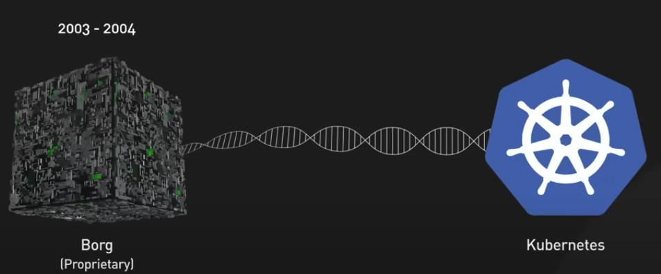
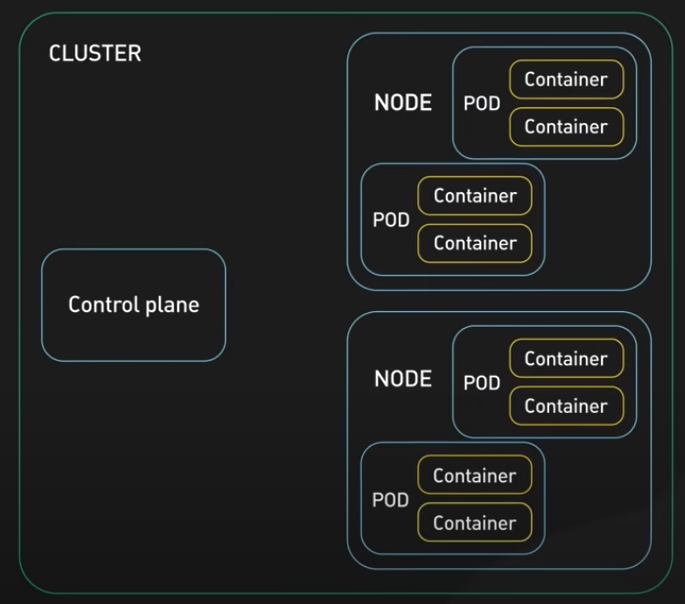
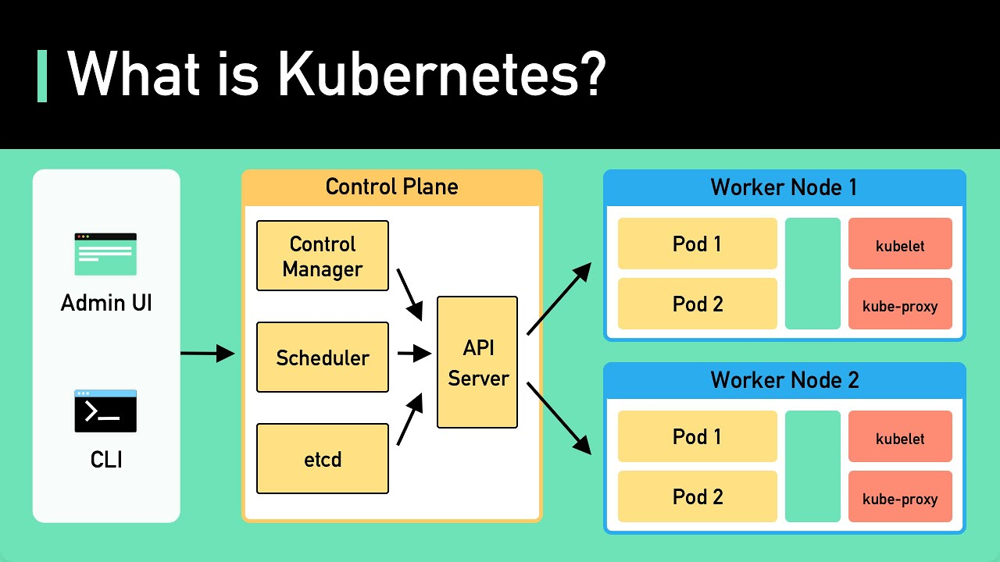
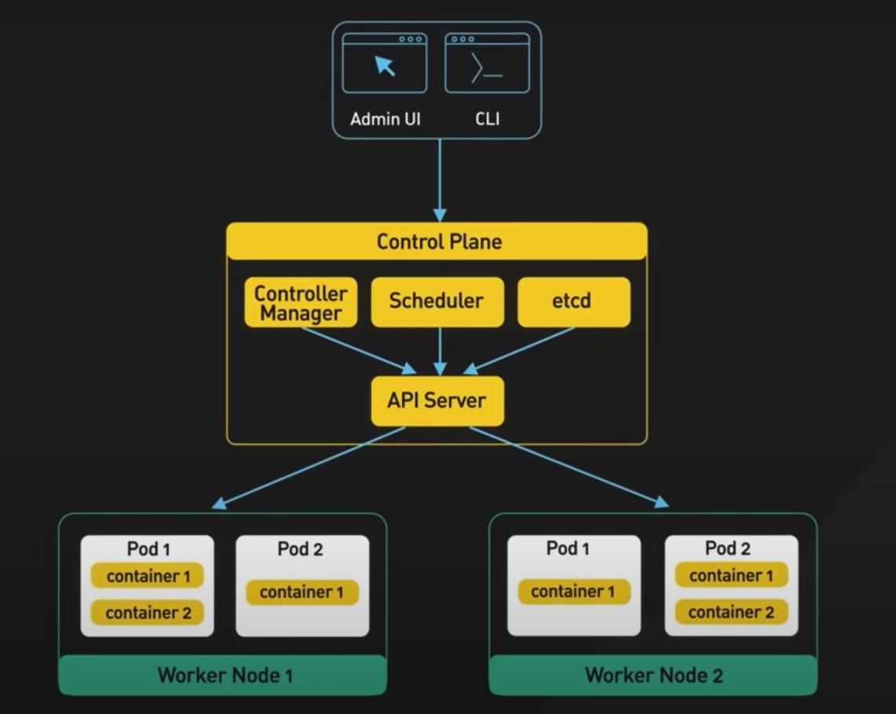
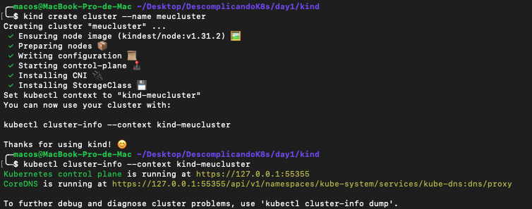
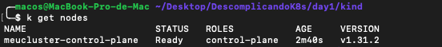
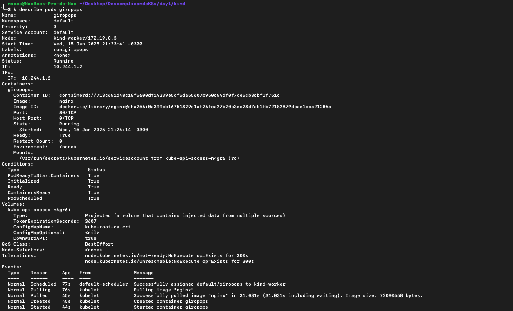
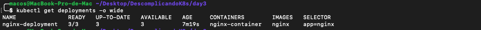
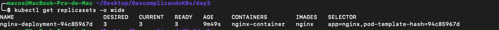

# Kubernetes: Guia essencial :rocket:

Este repositório foi criado durante os meus estudos para a certificação CKA, ajudando assim a compreender os conceitos-chave do Kubernetes e como utilizá-lo para orquestrar contêineres de maneira eficiente. Aqui você encontrará uma introdução teórica, exemplos práticos e dicas úteis para explorar essa poderosa ferramenta.
<hr>

#### :book: O que é Kubernetes?
Kubernetes (K8s) é uma plataforma open-source de orquestração de contêineres. Ele facilita a implantação, escalabilidade e gestão de aplicações conteinerizadas, garantindo alta disponibilidade e eficiência na alocação de recursos.

Ele foi originalmente desenvolvido pelo Google com o nome de BORG,que gerenciava a implantação de minhares de aplicativos no Google. Em 2014 o Google disponibilizou uma versão de códgo aberto do Borg, agora ele é mantido pela Cloud Native Computing Foundation (CNCF).

O nome Kubernetes tem origem no Grego, significando timoneiro ou piloto. K8s é a abreviação derivada pela troca das oito letras "ubernete" por "8", se tornado K"8"s.



<hr>

#### :key: Conceitos Básicos

**Container:** Container é uma tecnologia de virtualização usada para empacotar e isolar aplicações e suas dependências de forma simples, ou seja, container é isolamento de recursos. 

**Container engine:** É o responsável por gerenciar as imagens e volumes, ele é o responsável por garantir que os os recursos utilizados pelos containers estão devidamente isolados, ou seja, é o responsável por criar o container e verificar se ele esta funcionando corretamente.
Hoje temos diversas opções para se utilizar como container engine: Docker Engine, Podman e o CRIO.
    
**Container runtime:** é o responsável por executar os containers nos nós(nodes). Quando você está utilizando ferramentas como Docker ou Podman para executar containers em sua máquina, por exemplo, você está fazendo uso de algum Container Runtime, ou melhor, o seu Container Engine está fazendo uso de algum Container Runtime, em outras palavras ele é o responsável por fazer as comunicações entre o container engine e o Kernel do host. (Ele executa os containeres).

Temos três tipos de Container Runtime:
* **Low-level:** são os Container Runtime que são executados diretamente pelo Kernel, como o runc, o crun e o runsc.
    
* **High-level:** são os Container Runtime que são executados por um Container Engine, como o containerd, o CRI-O e o Podman.
    
* **Sandbox e Virtualized:** são os Container Runtime que são executados por um Container Engine e que são responsáveis por executar containers de forma segura. O tipo Sandbox é executado em unikernels ou utilizando algum proxy para fazer a comunicação com o Kernel. O gVisor é um exemplo de Container Runtime do tipo Sandbox. Já o tipo Virtualized é executado em máquinas virtuais. A performance aqui é um pouco menor do que quando executado nativamente. O Kata Containers é um exemplo de Container Runtime do tipo Virtualized.\

**OCI (Open Container Initiative):** A OCI é uma organização sem fins lucrativos que tem como objetivo padronizar a criação de containers, para que possam ser executados em qualquer ambiente. A OCI foi fundada em 2015 pela Docker, CoreOS, Google, IBM, Microsoft, Red Hat e VMware e hoje faz parte da Linux Foundation.
O principal projeto criado pela OCi é o runc, é um container runtime de baixo nível amplamente utilizado por diversos Container Engines, incluindo o Docker. Este projeto, totalmente open source, é escrito em Go e seu código fonte pode ser acessado no GitHub.

**Cluster:** É o ambiente do kubernetes e é composto por:
* **Control Plane:** ele é o responsável por gerenciar o cluster e possui a resposabilidade de armazenar o seu estado e de manter a saúde e disponibilidade do cluster.
* **Nodes:** Máquinas (físicas ou virtuais) que executam os containers.



**Pods:** É o menor objeto do k8s. Como dito anteriormente, o k8s não trabalha com os contêineres diretamente, mas organiza-os dentro de pods, que são abstrações que dividem os mesmos recursos, como endereços, volumes, ciclos de CPU e memória. Um pod hospeda um ou mais contêineres e fornece armazenamento e rede compartilhados para esses contêineres.


**Deployments:** É um dos principais controllers utilizados, é ele que define as características do nosso pod/serviço. O Deployment, em conjunto com o ReplicaSet, garante que determinado número de réplicas de um pod esteja em execução nos nós workers do cluster. Além disso, o Deployment também é responsável por gerenciar o ciclo de vida das aplicações, onde características associadas a aplicação, tais como imagem, porta, volumes e variáveis de ambiente, podem ser especificados em arquivos do tipo yaml ou json para posteriormente serem passados como parâmetro para o kubectl executar o deployment. Esta ação pode ser executada tanto para criação quanto para atualização e remoção do deployment


* **Services:** É uma forma de você expor a comunicação através de um ClusterIP, NodePort ou LoadBalancer para distribuir as requisições entre os diversos Pods daquele Deployment. Funciona como um balanceador de carga.

* **ReplicaSets:** É um controller que vai garantir a quantidade de pods em execução no nó;

* **Namespaces:** Permitem a divisão lógica do cluster em ambientes isolados, como desenvolvimento, homologação e produção.

**Volumes** 
Os volumes no K8S são uma forma de armazenar dados persistentes ou temporários para os contêineres e um Pod. Eles oferecem uma solução para superar a limitação de armazenamento efêmero dos contêineres, onde os dados são perdidos quando o contêiner é reiniciado.

Cada volume é montado no sistema de arquivos do contêiner e pode ser acessado por um ou mais contêineres no mesmo Pod. O ciclo de vida do volume está atrelado ao ciclo de vida do Pod que o utiliza.

Principais tipos de volumes em Kubernetes
* **emptyDir**: 
Um volume temporário que é criado ao iniciar o Pod e é apagado quando o Pod é excluído.
Ideal para dados que precisam ser compartilhados entre os contêineres de um Pod durante sua execução.

* **hostPath**: 
Monta um diretório ou arquivo do nó hospedeiro dentro do Pod. Usado em casos específicos, como acessar recursos do host. Pode causar problemas de segurança e portabilidade.  

* **persistentVolumeClaim (PVC)**:
Vincula um Pod a um recurso de armazenamento persistente (PersistentVolume). É a abordagem recomendada para armazenamento durável e pode ser integrado com provedores de armazenamento, como EBS (AWS), Google Persistent Disk, ou NFS.

* **configMap**
Monta configurações como arquivos ou variáveis de ambiente dentro do contêiner. É útil para separar configurações do código da aplicação.

* **secret**
Similar ao ConfigMap, mas usado para armazenar dados sensíveis, como senhas, tokens e certificados. Os dados são armazenados em base64 e podem ser montados como arquivos ou variáveis de ambiente.

* **nfs**
Permite montar volumes NFS (Network File System) no Pod. É uma boa escolha para armazenamento compartilhado.

Cada tipo de volume atende a diferentes necessidades, como persistência, compartilhamento de dados ou integração com provedores de armazenamento específicos. A escolha depende da aplicação e do ambiente em que o cluster Kubernetes está operando.
<hr>

### 🧩 Arquitetura do K8S
Assim como os demais orquestradores disponíveis, o k8s também segue um modelo control plane/workers, constituindo assim um cluster, onde para seu funcionamento é recomendado no mínimo três nós: o nó control-plane, responsável (por padrão) pelo gerenciamento do cluster, e os demais como workers, responsáveis por executar as aplicações.



* **Control Plane:** Como já sabemos o ***Control Plane*** é o responsável por gerenciar o cluster, mantendo a saúde e disponibilidade do ambiente kubernetes.
**Componentes de um Control Plane**
    * **etcd:** É um datastore chave-valor que o kubernetes utiliza para armazenar as especificações, status e configurações do cluster, ele conversa com somente com Api Server.
    * **API Server:** É o ponto de entrada para todas as interações com o cluster recebendo comandos e ou solicitações via kubectl, dashboards ou APIS externas. Ele server como intermediário entre os outros componentes do cluster. Todas as comunicações passam por ele. 
    * **Scheduler:**  É o responsável por selecionar o nó que irá hospedar um determinado pod para ser executado. Esta seleção é feita baseando-se na quantidade de recursos disponíveis em cada nó, como também no estado de cada um dos nós do cluster, garantindo assim que os recursos sejam bem distribuídos.
    * **Controller Manager:** É o controller manager quem garante que o cluster esteja no último estado definido no etcd. Por exemplo: se no etcd um deploy está configurado para possuir dez réplicas de um pod, é o controller manager quem irá verificar se o estado atual do cluster corresponde a este estado e, em caso negativo, procurará conciliar ambos.

    \

* **Workers:** São os nodes onde as aplicações estão rodando, ele é o responsável por executar aplicações e suas cargas de trabalho.
    ***Principais funções de um Worker***
    1. **Execução de Pods:** Os Workers hospedam e executam os Pods, que são gerenciados pelo Control Plane.
    2. **comunicação com o Control plane:** Cada nó worker comunica-se com o nó mestre (ou Control Plane) para receber instruções sobre quais cargas de trabalho devem ser executadas.
    3. **Fornecimento de recursos:** Ele fornece CPU, memória, rede e armazenamento para os containeres rodarem.

    ***Componentes de um worker***
    Os nós workers possuem alguns componentes principais que permitem sua operação:
    1. **Kubelet:** O kubelet desempenha o papel de um agente do k8s que é executado nos nós workers. Em cada nó worker deverá existir um agente Kubelet em execução, encarregado de gerenciar efetivamente os pods direcionados pelo controller do cluster dentro dos nós. Para isso, o Kubelet pode iniciar, parar e manter os contêineres e os pods em funcionamento seguindo as instruções fornecidas pelo controlador do cluster.
    2. **Kube-proxy:** Age como um proxy e um load balancer. Este componente é responsável por efetuar roteamento de requisições para os pods corretos, como também por cuidar da parte de rede do nó.

##### Portas que devemos nos preocupar

**Control Plane**
|   Protocol	|   Direction	|   Port   Range	|         Purpose       |       Used By       |
| ------------- | ------------- | ----------------- | --------------------- | ------------------- |  
| TCP	        | Inbound	    | 6443*	            | Kubernetes API server	| All                 |
| TCP	        | Inbound	    | 2379-2380         | etcd server client API| kube-apiserver, etcd|
| TCP	        | Inbound	    | 10250	            | Kube API	            | Self,CtrlPlane      |
| TCP	        | Inbound	    | 10251	            | kube-scheduler	    | Self                |
| TCP	        | Inbound	    | 10252	            | kube-controller-manager| Self               |
* Toda porta marcada por * é customizável, você precisa se certificar que a porta alterada também esteja aberta.

**Workers**
|   Protocol	|   Direction	|   Port   Range	|         Purpose       |       Used By       |
| ------------- | ------------- | ----------------- | --------------------- | ------------------- |  
| TCP	        | Inbound	    | 10250             | Kubelet API       	| Self, Control plane |
| TCP	        | Inbound	    | 30000-32767       | NodePort              | Services All        |

<hr>

### :book: Instalação

É possível criar um cluster Kubernetes rodando em apenas um nó, porém é recomendado somente para fins de estudos e nunca executado em ambiente produtivo.

Caso você queira utilizar o Kubernetes em sua máquina local, em seu desktop, existem diversas soluções que irão criar um cluster Kubernetes, utilizando máquinas virtuais ou o Docker, por exemplo.

Com isso você poderá ter um cluster Kubernetes com diversos nós, porém todos eles rodando em sua máquina local, em seu desktop.

Alguns exemplos são:

* **Kind:** Uma ferramenta para execução de contêineres Docker que simulam o funcionamento de um cluster Kubernetes. É utilizado para fins didáticos, de desenvolvimento e testes. O Kind não deve ser utilizado para produção;

* **Minikube:** ferramenta para implementar um cluster Kubernetes localmente com apenas um nó. Muito utilizado para fins didáticos, de desenvolvimento e testes. O Minikube não deve ser utilizado para produção;

* **MicroK8S:** Desenvolvido pela Canonical, mesma empresa que desenvolve o Ubuntu. Pode ser utilizado em diversas distribuições e pode ser utilizado em ambientes de produção, em especial para Edge Computing e IoT (Internet of things)

* Caso deseje subir um cluster completo, composto por um control-plane e dois workes (3 VMS) usando o kubeadm você pode acompanhar o processo por [aqui](./Services/README.md)


#### 🧑‍💻 Instalação 
Para os nossos estudos vamos instalar o kubectl e o Kind.

* GNU/Linux
Vamos instalar o kubectl com os seguintes comandos:
```bash
curl -LO "https://dl.k8s.io/release/$(curl -L -s https://dl.k8s.io/release/stable.txt)/bin/linux/amd64/kubectl"
sudo install -o root -g root -m 0755 kubectl /usr/local/bin/kubectl
kubectl version --client
```

* MacOs
O kubectl pode ser instalado no MacOS utilizando tanto o Homebrew, quanto o método tradicional. Nesse exemplo vamos instalar com o Homebrew.

````bash
sudo brew install kubectl
kubectl version --client
````

**Customizando o kubectl**
* Auto-Complete
Execute o seguinte comando para configurar o alias e autocomplete para o kubectl.

No bash:
```bash
source <(kubectl completion bash) # configura o autocomplete na sua sessão atual (antes, certifique-se de ter instalado o pacote bash-completion).
echo "source <(kubectl completion bash)" >> ~/.bashrc # add autocomplete permanentemente ao seu shell.
```
No ZSH:
```bash
source <(kubectl completion zsh)
echo "[[ $commands[kubectl] ]] && source <(kubectl completion zsh)"
```

**Instalando o Kind**
O Kind (Kubernetes in Docker) é outra alternativa para executar o Kubernetes num ambiente local para testes e aprendizado, mas não é recomendado para uso em produção.

* No GNU/Linux:
Para fazer a instalação no GNU/Linux, execute os seguintes comandos.
```bash
[ $(uname -m) = x86_64 ] && curl -Lo ./kind https://kind.sigs.k8s.io/dl/v0.27.0/kind-linux-amd64
#curl -Lo ./kind https://kind.sigs.k8s.io/dl/v0.20.0/kind-linux-amd6
chmod +x ./kind
sudo mv ./kind /usr/local/bin/kind
```
Para fazer a instalação no MacOS, execute o seguinte comando.
* No MacOS:
```bash
sudo brew install kind
```
Ou:
```bash
curl -Lo ./kind https://kind.sigs.k8s.io/dl/v0.20.0/kind-darwin-amd64
chmod +x ./kind
mv ./kind /usr/bin/kind
```
<hr>

#### :book: Exemplos Práticos
Agora que já instalamos o kubectl e o kind vamos colocar em prática todos os conceitos chaves aprendidos até aqui.

**Criando um cluster com o Kind**
* Criando um cluster com o Kind:
```bash
kind create cluster --name meucluster
```


**Visualizando os clusters existentes**
```bash
kind get clusters
```

**Lista os nodes do cluster**
```bash
kubectl get nodes
```


**Executando nosso primeiro pod no k8s**
```bash
kubectl run nginx --image nginx --port 80
# Cria um pode pelo manifesto yaml, se o pode já existir atualiza as mudanças
kubectl apply -f pod.yaml
# Cria um novo pode
kubectl create -f pod.yaml
```
**Exemplo básico de um arquivo YAML para criar um pod**
```yaml
apiVersion: v1
kind: Pod
metadata:
  labels:
    run: girus
    app: webserver
    service: nginx
    author: Bruno_Salmito
  name: girus
spec:
  containers:
  - image: nginx
    name: girus
    resources: {}
  dnsPolicy: ClusterFirst
  restartPolicy: Always
```

**Listando os pods**
```bash
kubectl get pods
kubectl get pods -A
kubectl get pods -n namespaceName -o wide 
```

**Expondo o pod e criando um service**
```bash
kubectl expose pod nginx --type NodePort
```

**Listando os services**
```bash
kubectl get service
```

**Listando informações de um pod**
```bash
kubectl describe pods podname
```


**Exemplo de um manifesto YAML para criar volume**
```yaml
apiVersion: v1
kind: Pod
metadata:
  labels:
    run: webserver
    app: webserver
    service: nginx
    author: Bruno_Salmito
  name: webserver
spec:
  containers:
  - image: nginx
    name: webserver
    ports:
    - containerPort: 80
    volumeMounts:
    - name: app-volume
      mountPath: /var/app
    resources:
      limits:
        cpu: "0.5"
        memory: "128Mi"
      requests:
        cpu: "0.3"
        memory: "64Mi"
  dnsPolicy: ClusterFirst
  restartPolicy: Always
  volumes:
  - name: app-volume
    emptyDir:
      sizeLimit: 256Mi
```
**Exemplo de mafiesto para criar um deployment**
```yaml
apiVersion: apps/v1
kind: Deployment
metadata:
  name: nginx-deployment
  labels:
    app: nginx-deployment
spec:
  replicas: 3
  selector:
    matchLabels:
      app: nginx
  strategy: {}
  # Definições do pod
  template:
    metadata:
      labels:
        app: nginx
    spec:
      containers:
      - name: nginx-container
        image: nginx
        resources:
          limits:
            memory: "128Mi"
            cpu: "0.5"
        ports:
        - containerPort: 80
```
**Listando os deployments**
```yaml
kubectl get deployments -o wide
```


**Listando os replica sets**
```yaml
kubectl get replicasets -o wide
```


<hr>

* Para estudar mais sobre Deployment você pode continuar [aqui](./Deployments/README.md)
* Para estudar mais sobre Estratégias de update você pode continuar [aqui](./Strategy/README.md)
* Para estudar mais sobre DaemonSet e ReplicaSet você pode continuar [aqui](./DaemonSetReplicaSet/README.md)
* Para estudar mais sobre Probes você pode continuar [aqui](./Probes/README.md)
* Para estudar mais sobre Volumes você pode continuar [aqui](./Volumes/README.md)
* Para estudar mais sobre Volumes você pode continuar [aqui](./Services/README.md)

<hr>
* Montar um cluster Kubernetes completo com um Control Plane e dois workes (3 VMS) [aqui](./Cluster/README.md)


<!--
#### :folder: Estrutura do Repositório

#### :chain: Recursos adicionais

#### Boas Práticas
-->
#### 📜 Referências
* https://kubernetes.io
* https://github.com/kubernetes/kubernetes/
* https://github.com/kubernetes/kubernetes/issues
* https://github.com/badtuxx/DescomplicandoKubernetes?tab=readme-ov-file

Abaixo temos as páginas oficiais das certificações do Kubernetes (CKA, CKAD e CKS):

* https://www.cncf.io/certification/cka/
* https://www.cncf.io/certification/ckad/
* https://www.cncf.io/certification/cks/

#### 🤝 Contribuições
Contribuições são bem-vindas! Sinta-se à vontade para abrir issues ou enviar pull requests com melhorias, correções ou novos exemplos.

1. Faça um fork deste repositório.
2. Crie um branch: git checkout -b feature/nome-da-sua-feature.
3. Submeta suas alterações: git push origin feature/nome-da-sua-feature.
4. Abra um Pull Request.

<!--

-->
